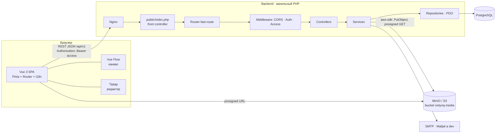
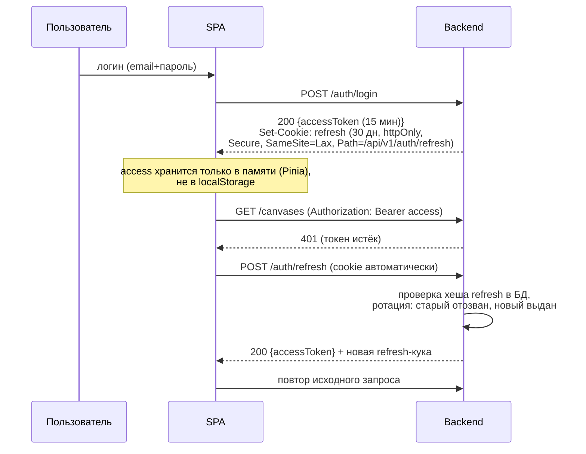
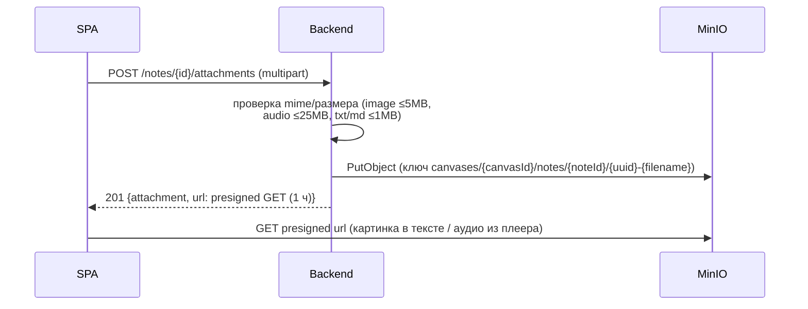
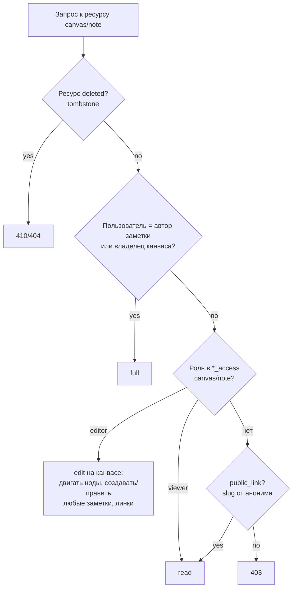

# Архитектура

## Общая схема



- Фронт и бэк раздельные: SPA отдаётся с `http://localhost:5173` (dev) / статики за nginx (prod), API живёт на `http://localhost:8000`.
- Бэкенд — stateless REST (кроме refresh-куки), вся бизнес-логика в Services, доступ к БД только через Repositories (PDO, подготовленные запросы).

## Структура monorepo

```
/
├── apps/
│   ├── backend/
│   │   ├── public/index.php        # front controller
│   │   ├── src/
│   │   │   ├── Kernel.php          # bootstrap: config, DI, error handler
│   │   │   ├── Config/             # загрузка env + типизированный конфиг
│   │   │   ├── Http/               # Router, Request, Response, Json
│   │   │   ├── Middleware/         # CorsMiddleware, AuthMiddleware,
│   │   │   │                       # RefreshCookieMiddleware, RateLimit(auth)
│   │   │   ├── Controllers/        # Auth, Profile, Canvas, Note, Tag, Link,
│   │   │   │                       # Access, Invitation, Attachment, Search, Shared
│   │   │   ├── Services/           # AuthService, JwtService, MailService,
│   │   │   │                       # StorageService (S3), LinkParserService,
│   │   │   │                       # AccessService (единая проверка прав),
│   │   │   │                       # ArchiveService, SearchService
│   │   │   ├── Repositories/       # PDO-репозитории по таблицам
│   │   │   ├── Models/             # DTO-сущности
│   │   │   └── Support/            # Validator, исключения (ApiException и др.)
│   │   ├── migrations/             # NNN_name.sql (applied через schema_migrations)
│   │   ├── bin/migrate · bin/seed
│   │   ├── composer.json
│   │   └── Dockerfile
│   └── frontend/
│       └── src/
│           ├── api/                # http-клиент (fetch) + авто-refresh, модули API
│           ├── stores/             # auth, canvases, canvas(активный), notes, ui
│           ├── router/             # guards: requires-auth / requires-verified
│           ├── locales/            # ru.json, en.json
│           ├── views/              # Auth/*, Dashboard, CanvasView, SharedCanvas,
│           │                       # SharedNote, Profile, NotFound
│           ├── components/
│           │   ├── canvas/         # CanvasBoard, NoteNode, ContextMenu,
│           │   │                   # TagMenu, ImportanceFilter, ArchivePanel,
│           │   │                   # LinkLayer (edge-стилизация)
│           │   ├── note/           # NoteEditorModal, ManifestForm,
│           │   │                   # AttachmentList, AudioPlayer, DropZone
│           │   ├── editor/         # Tiptap-обвязка + расширение WikiLink
│           │   ├── share/          # AccessDialog, InviteForm
│           │   └── ui/             # Button, Modal, Toast, Dropdown… (свой CSS)
│           ├── composables/        # useGraph, useDropFiles, useDebounce,
│           │                       # useAccessGuard, useContextMenu
│           └── styles/             # дизайн-токены, base.css
├── docs/
├── docker-compose.yml
└── turbo.json · pnpm-workspace.yaml
```

## Ключевые потоки

### 1. Авторизация (без XSS-рисков)



- Refresh-токен в БД хранится как SHA-256-хеш; ротация на каждом refresh; reuse детектируется → вся семья токенов отзывается.
- Logout: отзыв refresh в БД + сброс куки.
- CORS: `Access-Control-Allow-Origin: <конкретный origin>`, `Access-Control-Allow-Credentials: true`, разрешены заголовки `Authorization`, `Content-Type`.

### 2. Регистрация и письма

`POST /auth/register` → пользователь с `email_verified_at = null` → письмо со ссылкой на клиентский роут `/verify-email`, который вызывает `POST /auth/verify-email` с `{token}` в теле (токен не попадает в URL/логи) → после верификации вход разрешён; до неё CRUD заметок/канвасов заблокирован (`EMAIL_NOT_VERIFIED`). Reset-пароль: `POST /auth/forgot-password` (всегда 202, без утечки существования email) → письмо с одноразовым токеном → `POST /auth/reset-password` (отзывает все refresh-токены). SMTP: PHPMailer; в dev — Mailpit.

### 3. Загрузка файлов (drop → S3)



- Upload идёт **через бэкенд** (прокси), прямых presigned PUT не используем — проще валидация и права.
- Drop `.md/.txt` на канвас/редактор → тот же upload + `POST /canvases/{id}/notes` с телом из файла (import-text эндпоинт принимает attachment id).

### 4. Косвенные ссылки (LinkParser)

При `PUT /notes/{id}/body`: бэк парсит markdown-исходник регулярным разборщиком `[[target|label]]`, резолвит `target` (id заметки канваса или точное совпадение заголовка внутри канваса), пересоздаёт строки `indirect_links` для заметки в транзакции. Фронт при клике по `[[` показывает автодополнение по заметкам канваса и вставляет канонический `[[uuid|Заголовок]]`. Разрывы/переименования заголовков отображаются при следующем парсинге; недоступные наблюдения не рендерятся (см. доступы).

### 5. Проверка доступа (AccessService — единая точка)



- Права на заметку = max(права на канвас, собственные права заметки).
- Редактирует заметку: её автор, editor канваса, editor по инвайту заметки.
- Публичная (`public_link`) сущность доступна анониму **только на чтение** через read-only маршруты `/shared/*`.
- Приватность графа «ничего лишнего»: в выдаче канваса/заметки для зрителя отфильтровываются узлы и рёбра к сущностям, к которым у зрителя нет доступа; недоступный `[[wikilink]]` рендерится как обычный текст без оформления (без раскрытия факта существования).
- Ссылка на полностью удалённую заметку: tombstone `deleted_notes` даёт пометку «ссылка удалена» **только** тем, кто имел доступ к удалённой заметке.

### 6. Персистентность канваса

Позиции/размер нод (`x, y, width`) хранятся на заметке; патч отправляется дебаунсом (≈500 мс) `PATCH /canvases/{id}/nodes/{noteId}` после окончания перетаскивания/ресайза. Загрузка канваса — один запрос `GET /canvases/{id}/graph` (узлы + рёбра + теги + права текущего пользователя). Зум бесконечный — ограничение только мин/max масштаба Vue Flow (например 0.1–8).

## Конфигурация (env бэкенда)

| Переменная | Назначение |
|---|---|
| `APP_ENV`, `APP_URL`, `FRONTEND_URL` | режим, адреса (CORS, ссылки в письмах) |
| `DB_HOST`, `DB_PORT`, `DB_NAME`, `DB_USER`, `DB_PASS` | PostgreSQL |
| `JWT_SECRET`, `ACCESS_TTL=900`, `REFRESH_TTL=2592000` | токены |
| `S3_ENDPOINT`, `S3_REGION`, `S3_BUCKET`, `S3_ACCESS_KEY`, `S3_SECRET_KEY`, `S3_USE_PATH_STYLE=true` | MinIO/S3 |
| `SMTP_HOST`, `SMTP_PORT`, `SMTP_USER`, `SMTP_PASS`, `MAIL_FROM` | почта |
| `COOKIE_DOMAIN` (опц.), `COOKIE_SECURE` | refresh-кука |

## Ошибки и логирование

Единый обработчик: `ApiException {httpStatus, code, message, details}` → JSON `{error: {...}}`; непокрытые исключения → 500 `INTERNAL` (в prod без стека). Логирование — error_log/stdout контейнера, формат одна строка с context json. Валидация входных параметров — точечная в Controllers через `Support\Validator`, без «магии».

## Тестирование

- Backend: PHPUnit unit-тесты на `LinkParserService`, `AccessService`, `JwtService` — в v1 (этап 7, см. `docs/README.md`); интеграционные тесты с переносной БД и e2e — за пределами v1.
- Frontend: `vue-tsc` (уже в `pnpm build`); Vitest на клиентской логике и e2e (Playwright) — согласно `docs/ROADMAP.md`.
