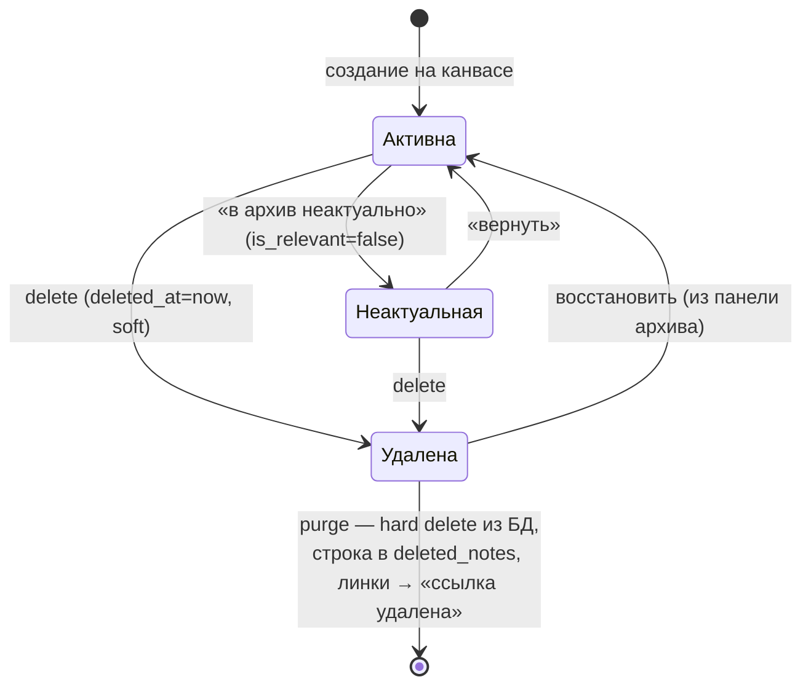
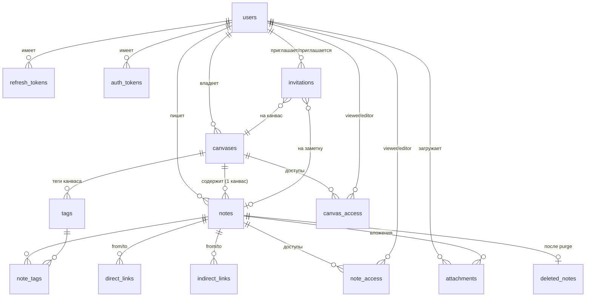

# Модель данных

PostgreSQL ≥ 15. Все id — `uuid` (`gen_random_uuid()`), время — `timestamptz`, по умолчанию `now()`. Первичные ключи составные там, где это связи M2M. `citext` — для email и имён тегов (уникальность без учёта регистра).

## Таблицы

### users

| Поле | Тип | Описание |
|---|---|---|
| id | uuid PK | |
| email | citext UNIQUE NOT NULL | логин |
| password_hash | text NOT NULL | `password_hash()` (argon2id/bcrypt) |
| display_name | text NOT NULL | имя для UI |
| avatar_attachment_id | uuid NULL FK → attachments | аватар |
| email_verified_at | timestamptz NULL | null = не верифицирован |
| created_at / updated_at | timestamptz | |

### refresh_tokens

| Поле | Тип | Описание |
|---|---|---|
| id | uuid PK | |
| user_id | uuid FK → users ON DELETE CASCADE | |
| token_hash | char(64) UNIQUE | SHA-256 от токена |
| family_id | uuid | группа ротации (reuse-detection) |
| expires_at | timestamptz | |
| created_at | timestamptz | |
| revoked_at / replaced_by | timestamptz / uuid NULL | ротация |

Индексы: `(user_id)`, `(family_id)`.

### auth_tokens

Одноразовые токены верификации email и сброса пароля.

| Поле | Тип |
|---|---|
| id | uuid PK |
| user_id | uuid FK CASCADE |
| purpose | text CHECK IN ('email_verify','password_reset') |
| token_hash | char(64) UNIQUE |
| expires_at | timestamptz (1 ч / 30 мин) |
| used_at | timestamptz NULL |

### canvases

| Поле | Тип | Описание |
|---|---|---|
| id | uuid PK | |
| owner_id | uuid FK → users CASCADE | владелец |
| title | text NOT NULL | |
| access_level | text CHECK ('private','specific','public_link') | по умолчанию **'private'** |
| public_slug | text UNIQUE NULL | гранит публичной read-only ссылки; NULL = ссылка выключена |
| created_at / updated_at | timestamptz | |

Индекс `(owner_id)`.

### notes

Заметка всегда принадлежит ровно одному канвасу. Автор может отличаться от владельца канваса (заметку создал editor по инвайту).

| Поле | Тип | Описание |
|---|---|---|
| id | uuid PK | |
| canvas_id | uuid FK → canvases CASCADE | |
| author_id | uuid FK → users | автор |
| title | text NOT NULL | |
| body_md | text NOT NULL DEFAULT '' | markdown-исходник с `[[...]]` |
| importance | smallint CHECK 1..5 | по умолчанию 3 |
| is_relevant | boolean | false = «неактуально», в архиве |
| x, y | double precision | позиция ноды на канвасе |
| width | int | размер ноды; высота — у Vue Flow |
| created_at / updated_at | timestamptz | |
| deleted_at | timestamptz NULL | soft delete |

Индексы: `(canvas_id)`, `(canvas_id) WHERE deleted_at IS NULL`, GIN на теги через `note_tags`.

### tags (per-canvas)

| Поле | Тип |
|---|---|
| id | uuid PK |
| canvas_id | uuid FK → canvases CASCADE |
| name | citext NOT NULL |
| color | text (`#rrggbb`) |

UNIQUE `(canvas_id, name)`. Rename/delete тега — UPDATE/DELETE одной строки, `note_tags` каскадирует.

### note_tags

| Поле | Тип |
|---|---|
| note_id | uuid FK → notes CASCADE |
| tag_id | uuid FK → tags CASCADE |

PK `(note_id, tag_id)`, индекс `(tag_id)`.

### direct_links

Прямые (ручные) ссылки, направленные: from → to (родитель → дочерняя). Сплошная линия со стрелкой.

| Поле | Тип |
|---|---|
| id | uuid PK |
| from_note_id | uuid FK → notes CASCADE |
| to_note_id | uuid FK → notes CASCADE |
| created_by | uuid FK → users |
| created_at | timestamptz |

UNIQUE `(from_note_id, to_note_id)`, CHECK `from != to`, индексы по обоим концам. Циклы разрешены. Обе заметки должны быть из одного канваса (проверяется на уровне сервиса).

### indirect_links

Кэшированный разбор `[[wikilinks]]` из `body_md`. Пересоздаётся полностью для заметки в транзакции при каждом сохранении тела.

| Поле | Тип |
|---|---|
| id | uuid PK |
| from_note_id | uuid FK → notes CASCADE |
| to_note_id | uuid NULL | FK → notes CASCADE |
| raw_target | text NOT NULL | исходная строка `[[...]]` |
| resolved | boolean | резолвится ли в существующую заметку |

Индексы `(from_note_id)`, `(to_note_id)`. Нерезолвнутые хранятся для пометки «ссылка удалена» и для автодополнения.

### deleted_notes (tombstone)

Создаётся при **полном** удалении (purge) заметки, чтобы её линки можно было отобразить как «ссылка удалена» (только имеющим доступ).

| Поле | Тип |
|---|---|
| note_id | uuid PK |
| canvas_id | uuid |
| title_snapshot | text |
| deleted_by | uuid FK → users SET NULL |
| deleted_at | timestamptz |

При восстановлении невозможна (заметки уже нет) — tombstone живёт, пока существуют ссылки.

### canvas_access / note_access (одинаковая структура)

| Поле | Тип |
|---|---|
| canvas_id / note_id | uuid FK CASCADE |
| user_id | uuid FK → users CASCADE |
| role | text CHECK ('viewer','editor') |
| created_at | timestamptz |

PK `(canvas_id, user_id)` / `(note_id, user_id)` соответственно. Владелец и автор в таблице **не** хранятся — они имеют полный доступ по праву владения.

### invitations

Инвайт по email (принятый или ожидающий регистрации).

| Поле | Тип |
|---|---|
| id | uuid PK |
| resource_type | text CHECK ('canvas','note') |
| resource_id | uuid |
| email | citext NOT NULL |
| user_id | uuid FK → users NULL | заполняется при регистрации/приёмке |
| role | text CHECK ('viewer','editor') |
| status | CHECK ('pending','accepted','declined','revoked') |
| token_hash | char(64) UNIQUE | для письма-приглашения |
| invited_by | uuid FK → users |
| created_at / responded_at | timestamptz |

Правило: при регистрации с email, на который есть pending-инвайты, они автоматически становятся `accepted` и создаются строки `*_access`.

### attachments

| Поле | Тип | Описание |
|---|---|---|
| id | uuid PK | |
| uploader_id | uuid FK → users | |
| note_id | uuid FK → notes SET NULL NULL | `null` = аватар/непривязанный |
| kind | text CHECK ('image','audio','text_import','avatar') | |
| s3_key | text UNIQUE | `canvases/{canvasId}/notes/{noteId}/{uuid}-{filename}` |
| filename | text | оригинальное имя |
| mime | text | |
| size_bytes | bigint | лимиты: image 5MB, audio 25MB, text 1MB |
| width / height | int NULL | только для картинок |
| created_at | timestamptz | |

### schema_migrations

`version text PK, applied_at timestamptz`.

## Жизненный цикл заметки

- «Неактуальная»: скрыта с канваса (видна только с фильтром «показывать неактуальные»), доступна по оставшимся ссылкам.
- «Удалена» (soft): нода скрыта, заметка в списке «удалённые» панели архива; линки на неё показываются имеющим доступ с пометкой и кнопкой «восстановить».
- «Purge»: физическое удаление строки `notes`; вместо неё — tombstone. Ноды на канвасе нет, линк: «ссылка удалена» (видят только имевшие доступ), анонимы и посторонние линк не видят вовсе.
- Удаление канваса: hard delete с каскадом всех заметок/линков/тегов/доступов (подтверждение в UI).

## ER-диаграмма

